<div align="center">


<a href="https://git.io/typing-svg">
  
</a>

<p>
  
  
  
</p>

</div>

<br>

<table width="100%">
<tr>
<td width="55%" valign="top">

##  **Sobre mim**

```java
public class Vinicius implements BackendDeveloper {

    private String role     = "Back-end Developer";
    private String[] stack  = { "Java", "Spring Boot", "Node.js" };
    private String focus    = "APIs REST com Java";
    private String goal     = "Virar Dev Back-end profissional";

    @Override
    public String currentlyLearning() {
        return "Java, Spring Boot & arquitetura de APIs";
    }
}
```

- 🎓 &nbsp;Estudante de **Java**
- ☕ &nbsp;Stack principal: **Java + Spring Boot**
- 🟢 &nbsp;Stack secundária: **Node.js**
- ⚡ &nbsp;Objetivo: **virar Dev Back-end profissional**

</td>
<td width="45%" align="center">



</td>
</tr>
</table>

---

## 🛠️ **Tecnologias**

<div align="center">



<br><br>


</div>

---

## 📊 **GitHub Stats**

<div align="center">


<br>


<br><br>


</div>

---

## 🐍 **Contribuições**

<div align="center">
  <picture>
    <source media="(prefers-color-scheme: dark)" srcset="https://raw.githubusercontent.com/Ovinieu/Ovinieu/output/snake-dark.svg" />
    
  </picture>
</div>

---

## 📫 **Contato**

<div align="center">

<a href="https://www.linkedin.com/in/SEU-LINKEDIN"></a>
<a href="mailto:vinimarques12361@gmail.com"></a>
<a href="https://github.com/Ovinieu"></a>

<br><br>


</div>
